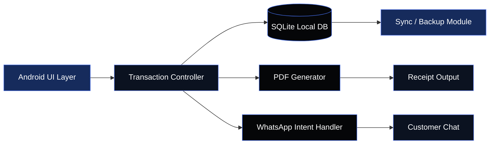

<div align="center">


<br>

<a href="https://github.com/Sohan-2807"></a>
<a href="https://www.linkedin.com/in/sohan-thammineni007/"></a>
<a href="mailto:thamminenisohan1977@gmail.com"></a>

<br><br>


</div>

---

### About Me

I'm **Sohan Thammineni**, a B.Tech Computer Science & Engineering student specializing in **Artificial Intelligence & Machine Learning** at **Lovely Professional University**, holding a **9.49 / 10.00 CGPA**.

I enjoy turning complex problems into practical software — my current focus spans **Machine Learning, Data Structures & Algorithms, Software Engineering, and offline-first applications**. I learn by building, experimenting, debugging, and shipping real projects.

```txt
> Ship it, then perfect it.
```

---

### Technical Stack

<div align="center">

**Languages**


**AI / Machine Learning**


**Databases · Development · Tools**


</div>

---

### GitHub Analytics

<div align="center">


</div>

---

### Contribution Snake

<div align="center">

</div>

> Generated automatically via a GitHub Actions workflow ([Platane/snk](https://github.com/Platane/snk)) — see setup note at the bottom.

---

### Metrics Dashboard

<div align="center">

</div>

---

### Most Used Languages (Visual Breakdown)

<div align="center">


</div>

---

### Architecture — Finance Collection App



---

### Selected Projects

<table width="100%">
<tr>
<td width="50%" valign="top">

**💰 Finance Collection App**

An offline-first Android finance system built around local SQLite persistence, transactional data handling, dynamic PDF generation, and WhatsApp intent integration.

`Android` `SQLite` `PDF Generation` `WhatsApp Intent`

**Impact:** ~80% reduction in manual tracking effort.

<a href="https://github.com/Sohan-2807/Eramalla_Financing_App"></a>

</td>
<td width="50%" valign="top">

**🧮 DSA & Algorithm Practice**

A continuously growing repository of Data Structures, Algorithms, programming fundamentals, and problem-solving exercises.

`C++` `Python` `C`

<a href="https://github.com/Sohan-2807/Practice"></a>

</td>
</tr>
</table>

---

### Recognition

| Achievement | Issuer | Date |
|---|---|---|
| 🥉 3rd Place — Full Stack Intelligence 1.0 Hackathon | Lovely Professional University | July 2026 |
| iamNeo Associated — C Programming Language | iamNeo | May 2026 |
| AI Basics Course | Infosys Springboard | March 2026 |
| C Programming Course | Udemy | January 2026 |
| Python Programming Course | Udemy | November 2025 |
| C Programming Course | Skill India | April 2025 |

---

### Trophy Case

<div align="center">

</div>

---

### Setting Up the Live Widgets

These sections pull live data and need a one-time setup in your **`Sohan-2807/Sohan-2807`** profile repo:

1. **Snake animation** — add [`platane/snk`](https://github.com/Platane/snk) as a GitHub Action (`.github/workflows/snake.yml`) so it generates `github-contribution-grid-snake-dark.svg` on the `output` branch automatically every 24h.
2. **Stats / Streak / Top Langs / Activity Graph** — no setup needed, these are hosted services (`github-readme-stats`, `github-readme-streak-stats`, `github-readme-activity-graph`) that render on request — just make sure your GitHub username matches (`Sohan-2807`).
3. **Metrics Dashboard** — powered by `lecoq.io/metrics`; works out of the box, but you can self-host it via their Action for faster refresh.
4. **WakaTime card** — only populates once you connect [WakaTime](https://wakatime.com) to your editor; otherwise it'll show "No coding activity" — safe to remove if you don't use WakaTime.
5. **Profile view counter** — already live via `komarev.com/ghpvc`, tracks visits automatically.

---

<div align="center">


<br><br>

<a href="https://github.com/Sohan-2807"></a>
<a href="https://www.linkedin.com/in/sohan-thammineni007/"></a>

<br><br>

<sub>© Sohan Thammineni · Building things that solve real problems.</sub>

</div>


