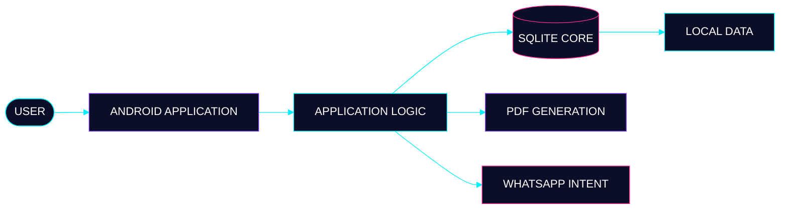

<div align="center">


<br>


<br>


</div>

---

<div align="center">

<a href="#01--systemidentity"></a> <a href="#02--technology-stack"></a> <a href="#03--deployed-systems"></a> <a href="#04--architecture"></a> <a href="#05--telemetry"></a> <a href="#06--achievement-archive"></a> <a href="#07--connect"></a>

</div>

<br>

<div align="center">

```text
╔══════════════════════════════════════════════════════════════╗
║                     SOHAN_OS :: CORE                        ║
╠══════════════════════════════════════════════════════════════╣
║  MACHINE LEARNING     ████████████████████   ONLINE         ║
║  ALGORITHM ENGINE     ████████████████████   ONLINE         ║
║  SYSTEMS MODULE       ████████████████████   ONLINE         ║
║  BUILD PIPELINE       ████████████████████   SHIPPING       ║
╚══════════════════════════════════════════════════════════════╝
```

<sub><strong>Build systems. Understand fundamentals. Ship continuously.</strong></sub>

</div>

---

# `01` — SYSTEM.IDENTITY

<table>
<tr>
<td width="55%" valign="top">

```yaml
operator:       Thammineni Sohan
handle:         Sohan-2807

program:        B.Tech CSE — AI & ML
institution:    Lovely Professional University
cgpa:           9.49 / 10.00
location:       Punjab, India

focus:
  - Machine Learning
  - Algorithms & Data Structures
  - Systems Engineering
  - Offline-first Software

directive:      "Ship it, then perfect it."
status:         BUILDING
```

</td>

<td width="45%" valign="top">

### CURRENT OPERATING MODE

```text
┌──────────────────────────────┐
│                              │
│  LEARNING        [ ACTIVE ]  │
│  BUILDING        [ ACTIVE ]  │
│  DEBUGGING       [ ACTIVE ]  │
│  SHIPPING        [ ACTIVE ]  │
│                              │
└──────────────────────────────┘
```

**Primary objective**

Build practical software while strengthening the underlying foundations of algorithms, machine learning, and systems engineering.

</td>
</tr>
</table>

---

# `02` — TECHNOLOGY.STACK

<div align="center">


</div>

<br>

<table width="100%">
<tr>
<td width="25%" align="center">

### COMPUTE

```text
C++
Python
C
Dart
```

</td>

<td width="25%" align="center">

### INTELLIGENCE

```text
TensorFlow
PyTorch
scikit-learn
```

</td>

<td width="25%" align="center">

### DATA

```text
PostgreSQL
MongoDB
SQLite
```

</td>

<td width="25%" align="center">

### ENGINEERING

```text
Android
Git
GitHub
```

</td>
</tr>
</table>

---

# `03` — DEPLOYED.SYSTEMS

## `DEPLOYMENT_01` — Finance Collection System

> An offline-first Android finance system built around local persistence, transactional data handling, native intent integration, and dynamic document generation.

<table width="100%">
<tr>
<td width="50%" valign="top">

### SYSTEM COMPONENTS

```text
ANDROID
   │
   ├── SQLite
   ├── PDF Generation
   └── WhatsApp Intent
```

</td>

<td width="50%" valign="top">

### ENGINEERING PROFILE

| Layer        | Implementation            |
| ------------ | ------------------------- |
| Architecture | Offline-first             |
| Platform     | Android                   |
| Persistence  | SQLite                    |
| Automation   | WhatsApp Intent           |
| Documents    | Dynamic PDF               |
| Impact       | ~80% less manual tracking |

</td>
</tr>
</table>

<div align="center">

<a href="https://github.com/Sohan-2807/Eramalla_Financing_App">

</a>

</div>

---

## `DEPLOYMENT_02` — Algorithm Lab

> A continuously evolving environment for Data Structures, Algorithms, programming fundamentals, and problem solving.

```text
ALGORITHM_LAB
─────────────────────────────────────────────
LANGUAGES       C++ · Python · C
DOMAIN          DSA · Problem Solving
STATUS          CONTINUOUS DEVELOPMENT
ROLE            FOUNDATION LAYER
```

<div align="center">

<a href="https://github.com/Sohan-2807/Practice">

</a>

</div>

---

# `04` — ARCHITECTURE

## Finance Collection System



### DESIGN PRINCIPLES

```text
┌────────────────────────────────────────────────────────────┐
│                    OFFLINE-FIRST                           │
├────────────────────────────────────────────────────────────┤
│ Local persistence                                          │
│ Transactional data handling                                │
│ Native Android integration                                 │
│ Local PDF generation                                       │
│ WhatsApp intent integration                                │
└────────────────────────────────────────────────────────────┘
```

No servers, external APIs, or cloud infrastructure are claimed for this system.

---

# `05` — TELEMETRY

<div align="center">


<br>


<br><br>


</div>

<details>
<summary><strong>SYSTEM_MONITOR</strong> — open diagnostic display</summary>

<br>

```text
╔══════════════════════════════════════════════════════════╗
║                   SYSTEM MONITOR                         ║
╠══════════════════════════════════════════════════════════╣
║                                                          ║
║  ML_ENGINE          ████████████████████  ACTIVE         ║
║  ALGORITHM_CORE     ████████████████████  ACTIVE         ║
║  SYSTEMS_MODULE     ████████████████████  ACTIVE         ║
║  BUILD_PIPELINE     ████████████████████  SHIPPING       ║
║                                                          ║
╚══════════════════════════════════════════════════════════╝
```

<sub>These bars are a visual system theme, not measured proficiency scores.</sub>

</details>

---

# `06` — ACHIEVEMENT.ARCHIVE

<details>
<summary><strong>OPEN CERTIFICATION ARCHIVE</strong></summary>

<br>

| Achievement                                           | Organization                   | Date          |
| ----------------------------------------------------- | ------------------------------ | ------------- |
| **3rd Place — Full Stack Intelligence 1.0 Hackathon** | Lovely Professional University | July 2026     |
| **iamNeo Associated — C Programming Language**        | iamNeo                         | May 2026      |
| **AI Basics Course**                                  | Infosys Springboard            | March 2026    |
| **C Programming Course**                              | Udemy                          | January 2026  |
| **Python Programming Course**                         | Udemy                          | November 2025 |
| **C Programming Course**                              | Skill India                    | April 2025    |

</details>

---

# `07` — CONNECT

<div align="center">

```text
> establish_connection --linkedin
> transmit --email
> inspect --github
> enumerate --repositories
```

<br>

<a href="https://www.linkedin.com/in/sohan-thammineni007/">

</a>

<a href="mailto:thamminenisohan1977@gmail.com">

</a>

<a href="https://github.com/Sohan-2807">

</a>

<a href="https://github.com/Sohan-2807?tab=repositories">

</a>

</div>

---

# `08` — LIVE.REPOSITORY

<div align="center">

<a href="https://github.com/Sohan-2807">

</a>

<a href="https://github.com/Sohan-2807/Sohan-2807/commits/main/">

</a>

<a href="https://github.com/Sohan-2807?tab=repositories">

</a>

</div>

---

<div align="center">

```text
╔══════════════════════════════════════════════════════════════╗
║                                                              ║
║                         SOHAN_OS                             ║
║                                                              ║
║  BUILD  →  DEBUG  →  SHIP  →  ANALYZE  →  IMPROVE  →  LOOP  ║
║                                                              ║
║                     STATUS: BUILDING                        ║
║                                                              ║
╚══════════════════════════════════════════════════════════════╝
```

<br>

<em>“In a world of infinite loops, keep debugging your own code.”</em>

<br><br>

<strong>Thammineni Sohan</strong>

<br>

<sub>AI & ML · Systems · Algorithms · Software Engineering</sub>

</div>
