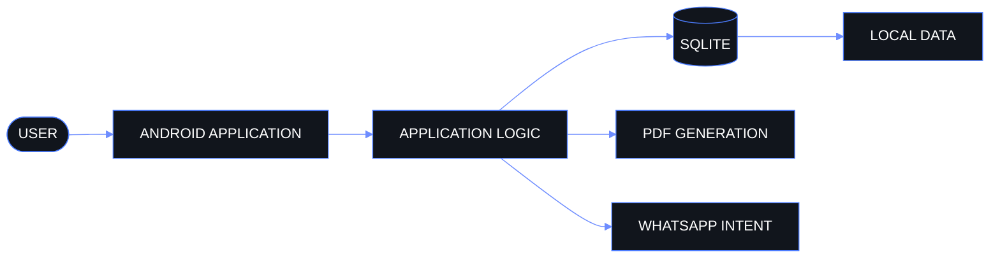

<div align="center">


<br>


<br>

<code>B.Tech CSE — AI & ML</code>
 ·  <code>Lovely Professional University</code>
 ·  <code>9.49 / 10.00</code>
 ·  <code>Punjab, India</code>

</div>

<br>

<div align="center">

<a href="#about">

</a>
<a href="#technical-arsenal">

</a>
<a href="#selected-work">

</a>
<a href="#architecture">

</a>
<a href="#telemetry">

</a>
<a href="#recognition">

</a>
<a href="#contact">

</a>

</div>

---

<a id="about"></a>

## `01 — ABOUT`

<table>
<tr>
<td width="58%" valign="top">

### Sohan Thammineni

I'm a **B.Tech Computer Science & Engineering student specializing in AI & ML** at Lovely Professional University.

I enjoy taking problems that look complicated at first and reducing them into systems that are understandable, reliable, and useful.

My current work sits around four areas:

* Machine Learning
* Data Structures & Algorithms
* Systems Engineering
* Offline-first software

I'm particularly interested in the space where **intelligence meets practical software engineering** — not just building models, but building systems around them.

</td>

<td width="42%" valign="top">

```text
PROFILE
────────────────────────────

NAME
Sohan Thammineni

HANDLE
Sohan-2807

PROGRAM
B.Tech CSE — AI & ML

CGPA
9.49 / 10.00

LOCATION
Punjab, India

CURRENT MODE
BUILDING
```

</td>
</tr>
</table>

<br>

<div align="center">

> **Build systems that solve real problems.
> Understand the fundamentals.
> Keep improving the implementation.**

</div>

---

<a id="technical-arsenal"></a>

## `02 — TECHNICAL ARSENAL`

### Tools I use to turn ideas into systems.

<table width="100%">
<tr>

<td width="20%" valign="top">

### PROGRAMMING

`C++`

`Python`

`C`

`Dart`

</td>

<td width="20%" valign="top">

### MACHINE LEARNING

`TensorFlow`

`PyTorch`

`scikit-learn`

</td>

<td width="20%" valign="top">

### DATA

`PostgreSQL`

`MongoDB`

`SQLite`

</td>

<td width="20%" valign="top">

### PLATFORMS

`Android`

</td>

<td width="20%" valign="top">

### ENGINEERING

`Git`

`GitHub`

</td>

</tr>
</table>

<br>

```text
COMPUTING
C++  ·  Python  ·  C  ·  Dart

INTELLIGENCE
TensorFlow  ·  PyTorch  ·  scikit-learn

DATA
PostgreSQL  ·  MongoDB  ·  SQLite

PLATFORMS
Android

TOOLING
Git  ·  GitHub
```

---

<a id="selected-work"></a>

## `03 — SELECTED WORK`

### `01` · Finance Collection System

**Offline-first Android finance software**

A finance system designed around local persistence and practical automation. The application uses SQLite for local transactional data, generates PDFs dynamically, and uses native WhatsApp intents for reminders.

<table width="100%">
<tr>
<td width="50%" valign="top">

**SYSTEM**

```text
Platform
Android

Architecture
Offline-first

Persistence
SQLite

Documents
Dynamic PDF generation

Automation
WhatsApp Intent
```

</td>

<td width="50%" valign="top">

**IMPACT**

```text
~80%

reduction in
manual tracking effort
```

The system is designed around local-first operation rather than a cloud-dependent workflow.

</td>
</tr>
</table>

<div align="center">

<a href="https://github.com/Sohan-2807/Eramalla_Financing_App">

</a>

</div>

---

### `02` · Algorithm Lab

**Data Structures · Algorithms · Problem Solving**

A continuously evolving practice environment built around programming fundamentals, algorithms, data structures, and problem solving.

```text
LANGUAGES
C++  ·  Python  ·  C

FOCUS
Data Structures
Algorithms
Programming Fundamentals
Problem Solving

STATUS
Continuous development
```

<div align="center">

<a href="https://github.com/Sohan-2807/Practice">

</a>

</div>

---

<a id="architecture"></a>

## `04 — ARCHITECTURE`

### Finance Collection System

The architecture is intentionally local-first.



### Design principles

<table width="100%">
<tr>
<td align="center">

**LOCAL-FIRST**

Data remains locally accessible.

</td>

<td align="center">

**TRANSACTIONAL**

Core persistence is handled through SQLite.

</td>

<td align="center">

**PRACTICAL**

Native Android capabilities handle integrations.

</td>

<td align="center">

**SIMPLE**

No unnecessary infrastructure.

</td>
</tr>
</table>

---

<a id="telemetry"></a>

## `05 — TELEMETRY`

<div align="center">


</div>

<br>

### Development surface

```text
GITHUB
 │
 ├── PROJECTS
 │
 ├── ALGORITHM PRACTICE
 │
 ├── EXPERIMENTS
 │
 ├── COMMITS
 │
 └── ITERATION
```

### Current development loop

```text
IDEA
  ↓
DESIGN
  ↓
IMPLEMENT
  ↓
TEST
  ↓
DEBUG
  ↓
SHIP
  ↓
LEARN
  └──────────────────→ REPEAT
```

<div align="center">

<a href="https://github.com/Sohan-2807">

</a>

<a href="https://github.com/Sohan-2807?tab=repositories">

</a>

<a href="https://github.com/Sohan-2807/Sohan-2807/commits/main/">

</a>

</div>

---

<a id="recognition"></a>

## `06 — RECOGNITION`

<details>
<summary><strong>OPEN RECOGNITION ARCHIVE</strong></summary>

<br>

| Recognition                                           | Organization                   | Date          |
| ----------------------------------------------------- | ------------------------------ | ------------- |
| **3rd Place — Full Stack Intelligence 1.0 Hackathon** | Lovely Professional University | July 2026     |
| **iamNeo Associated — C Programming Language**        | iamNeo                         | May 2026      |
| **AI Basics Course**                                  | Infosys Springboard            | March 2026    |
| **C Programming Course**                              | Udemy                          | January 2026  |
| **Python Programming Course**                         | Udemy                          | November 2025 |
| **C Programming Course**                              | Skill India                    | April 2025    |

</details>

---

## `07 — PRINCIPLES`

<table width="100%">
<tr>
<td width="33%" align="center">

### `01`

**SIMPLICITY**

Reduce unnecessary complexity.

</td>

<td width="33%" align="center">

### `02`

**FUNDAMENTALS**

Strong systems start with strong foundations.

</td>

<td width="33%" align="center">

### `03`

**ITERATION**

Build → learn → improve.

</td>
</tr>
</table>

<br>

<div align="center">

```text
"Ship it, then perfect it."
```

</div>

---

<a id="contact"></a>

## `08 — CONTACT`

<table width="100%">
<tr>
<td width="50%" valign="top">

### FIND ME

**GitHub**

https://github.com/Sohan-2807

**Repositories**

https://github.com/Sohan-2807?tab=repositories

**LinkedIn**

https://www.linkedin.com/in/sohan-thammineni007/

</td>

<td width="50%" valign="top">

### REACH ME

**Email**

[thamminenisohan1977@gmail.com](mailto:thamminenisohan1977@gmail.com)

**Commit history**

https://github.com/Sohan-2807/Sohan-2807/commits/main/

**Profile repository**

https://github.com/Sohan-2807/Sohan-2807

</td>
</tr>
</table>

---

<div align="center">


<br>

<code>BUILD</code>
 ·  <code>DEBUG</code>
 ·  <code>SHIP</code>
 ·  <code>REPEAT</code>

<br><br>

<strong>Sohan Thammineni</strong>

<br>

<sub>AI & ML · Systems · Algorithms · Software Engineering</sub>

</div>
